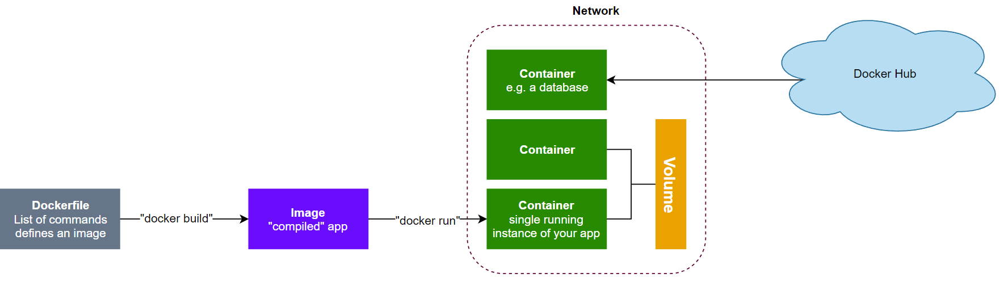
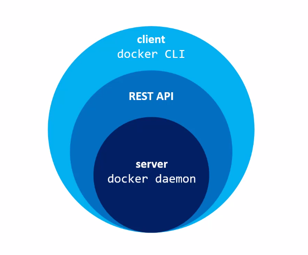
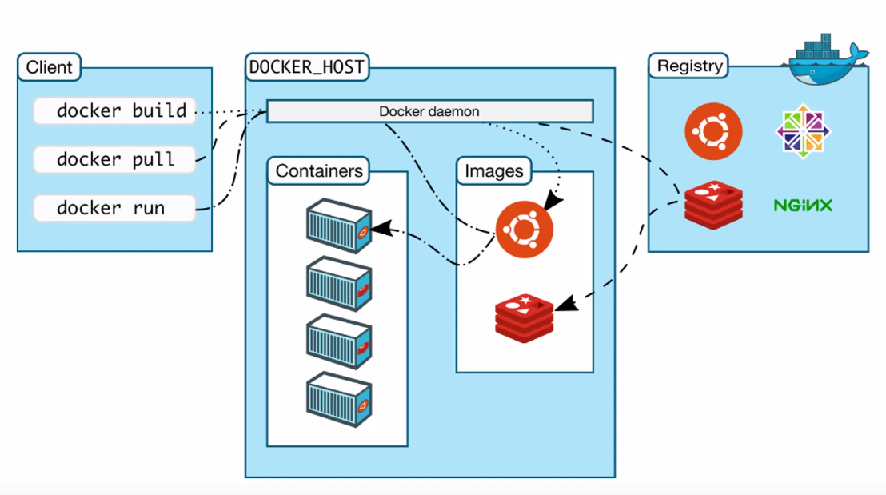

# Creating your first Docker service
Originally presented at Mintel's Chicago office accompanied by these [slides](https://docs.google.com/presentation/d/1rK9y6Qs6qcrbK3--qUYeeacr3z2BSVE48WI-DfX6gJM).

## § Prerequisites

* [docker-ce](https://docs.docker.com/install/linux/docker-ce/ubuntu/)
* [docker-compose](https://docs.docker.com/compose/install/)
* *optional* [pyenv](https://github.com/pyenv/pyenv-installer) with python 3.6, pip, pipenv
* *optional* [ctop](https://ctop.sh/) - "Top-like interface for container metrics"

Test everything is working.

```bash
docker --version
docker-compose --version

docker run -it --rm --name nyancat 06kellyjac/nyancat
```

## § Introduction

Have you ever heard a developer cry out in anguish, "it works on my machine, but not in production!" You're not alone.

#### What is Docker?

Docker is a software container platform.[^1] 

* **Developers** use Docker to eliminate "works on my machine" problems when collaborating.
* **Operators** use Docker to make the best possible use of the available hardware.
* **Enterprises** use Docker to build agile pipelines which produce faster, more secure applications.

We make better use of our hardware, making our software faster. We build more often because we have more trust in our results. And because we build more often our software is safer, and more reliable.

The key thing Docker does, "build once, deploy everywhere."

####  Terminology

##### Dockerfile

* Each line represents a command
* Docker caches the result of each command and layers them together - if you change a line, docker will invalidate the cache from that point on in the file

##### Images

* A single file
* Contains your code and dependencies
* Created from a dockerfile with the "docker build" command

##### Containers

* A running instance of an image
* Sandboxed

##### Volumes

* Optional, underlying data layer
* Data in containers isn't persistent. When the container dies, so does the data.
* Volumes can be persistent
* Can be accessed by multiple containers

##### Networks

* Docker comes with it's own networking capabilities.
* The name of a container is its hostname
* Allows you to `ping container_one` from container_two



#### The Docker Daemon and CLI



Usually, when someone refers to Docker, they are talking about the Docker daemon and CLI.

##### Docker Daemon

* A service that runs on your host operating system.
* It only runs on linux, because it depends on a number of linux kernel features.

##### REST API

* The daemon exposes all of its functionality through a REST API.
* There are many different tools for docker, and they all use this well-documented API to interact with the docker server.
* For example, this API will let you manage containers, images, networks, and data volumes.

##### Client (docker cli)

* The most wide-spread tool for docker is docker CLI.
* It's a command line tool that lets you interact with docker daemon directly.
* When you install docker, you get both the docker daemon and CLI tool.

The daemon and cli tool are an example of client-server architecture. There are many different tools for docker; explore and find others that you like! One example is ctop, which lets you monitor docker containers on your computer with a "top-like" interface.

*It's worth mentioning that both docker and docker CLI are open source and written in golang!*



Let's dig a little deeper into docker's client-server architecture.

- When you install docker on your computer, `DOCKER_HOST` will point to the docker daemon service running locally.
- However, it can be pointed to remote location. This is how the docker daemon works on windows and macOS, where the daemon is run in a virtual machine (confusing, I know) because, as mentioned earlier, docker daemon only runs on linux and depends on the linux kernel.


## § Docker vs virtual machines

To understand why Docker is the new shiny, we must first understand how Docker differs from the Virtual Machines we've used in the past.


The layers in a VM stack are:

1. **Infrastructure**: This is the hardware you're running on.
2. **Host operating system**: Usually a variation of Linux. On your laptop, this is probably ubuntu or fedora.
3. **Hypervisor**: You can think of a virtual machine as a complete, self-contained, simulated computer packaged into a file. Something needs to run that file, and that's where the hypervisor comes in.
   * Type 1: Direct link to infrastructure's hardware. Examples include Hyper-V on Windows, Hyperkit on macOS, and KVM on Linux.
   * Type 2: Runs an application on your host operating system. Examples include VirtualBox or VMWare.
   * Type 1 is usually far more efficient.
4. **Guest OS**
   * Each guest OS uses provisioned CPU, RAM, and disk space
   * In each OS, you must install your required dependencies (for example: python, postgres, redis)
   * Finally, you add your application.


1. Docker also requires a **infrastructure** and a **host operating system**. However, docker only runs on Linux. Most major versions of linux are supported.
   * You can also develop on windows (pls no) or macOS
2. **Docker Daemon**:
   * Communicates directly with the host operating system and knows how to ration out resources for the running containers.
   * It's also an expert at ensuring each container is isolated from the host OS and other containers.
3. We still need **dependencies** to make our application work, but instead of requiring a host OS, we can bundle them up into a "docker image."
4. Our **application** code (if interpreted) or compiled application also lives in the compiled image.

---

In the past, we've used virtual machines to isolate applications. Containerization does this better!

A good analogy I've found[^2]  describes virtual machines as houses each with their own resources, while Docker containers are apartments, residing in a building where resources are shared more efficiently.

| Virtual Machines  | Docker                                                       |
| ----------------- | ------------------------------------------------------------ |
| Isolates systems  | Isolates applications                                        |
| Starts in minutes | Starts in milliseconds                                       |
| Full OS           | *Can* be a full OS, but ideally a single process (microservice) |

Other pros of using Docker:

* Generally faster
  * Lower system overhead
  * Shared kernel and libraries
* The program you tested while developing is identical to what will run in production
* Never ask infra to install a package on an app VM ever again!

---


build example service maybe a score keeping app which stores the 

delete parts of the finished site and write slides on adding them

demonstrate debugging with exec and logging


## § References

[^1]: https://github.com/jonnylangefeld/learning/tree/master/Docker
[^2]: https://www.youtube.com/watch?v=pGYAg7TMmp0 "What is Docker & Docker Containers, Images, etc?"

